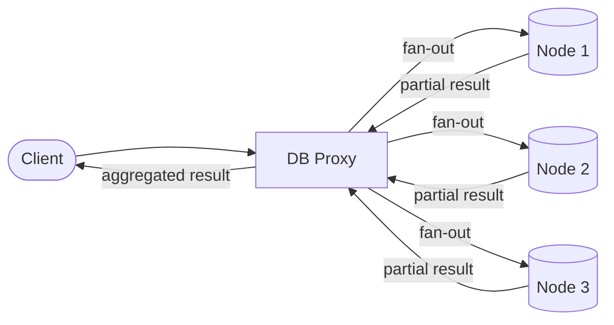
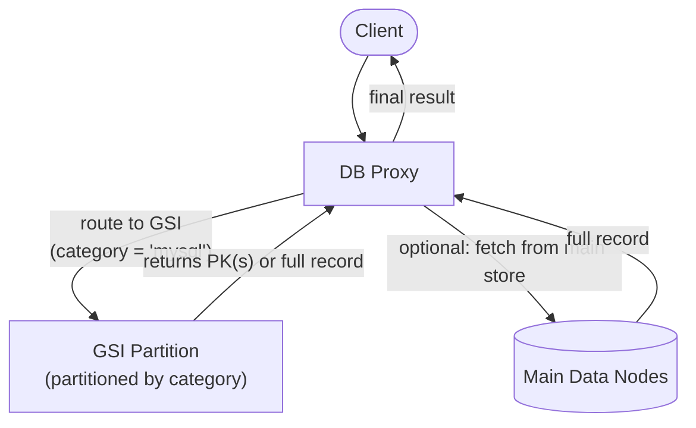
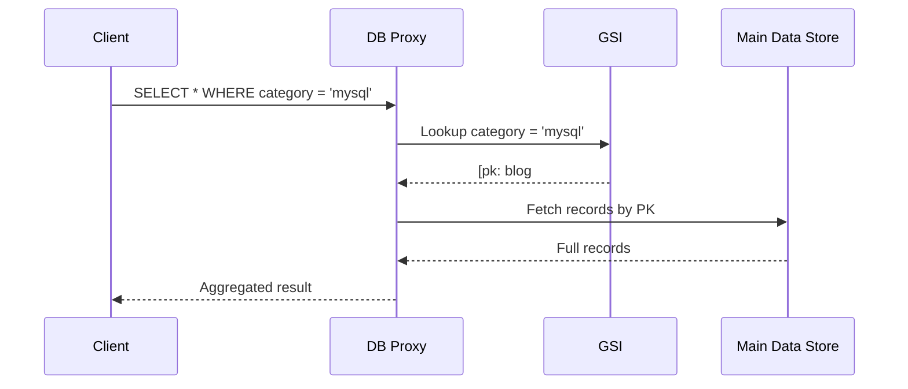
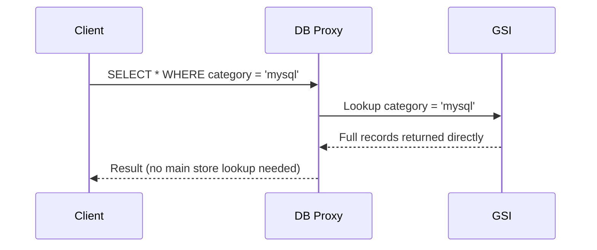
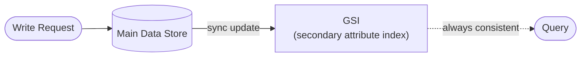

# How Indexing Makes Databases Faster

##  How Data Is Stored in a Relational Database

In relational databases, data is organized into **tables**, and each table stores data as individual **records** (rows). Consider a `users` table with the following structure:

| Column    | Size  |
|-----------|-------|
| `id`      | 4 B   |
| `name`    | 20 B  |
| `address` | 60 B  |
| `phone`   | 8 B   |
| `age`     | 8 B   |
| **Total** | **100 B per record** |

---

## Disk Block Allocation

Databases read data from disk in fixed-size chunks called **blocks**. Assume:

- **Block size** = 600 B
- **Total records** = 100

**Records per block:**
```
600 B ÷ 100 B = 6 records/block
```

**Total blocks needed:**
```
⌈100 ÷ 6⌉ = ⌈16.67⌉ = 17 blocks
```

So the entire `users` table spans **17 disk blocks**.

---

## Query Without an Index

Now consider running this query:

```sql
SELECT * FROM users WHERE age = 23;
```

Without an index, the database performs a **full table scan** — it reads every block one by one, checks each record against the condition, and collects the matching rows.

| Metric               | Value                  |
|----------------------|------------------------|
| Blocks to read       | 17                     |
| Time per block read  | ~1 sec                 |
| **Total time**       | **~17 sec** (worst case ~100 sec if scattered) |

> Every query on an un-indexed table costs a full scan, regardless of how many rows actually match.

---

## 🔍 What Is an Index?

An **index** is a small, separate lookup table that maps a column's values to the physical row locations in the main table. It is typically built on a specific column (e.g., the primary key or any frequently queried column).

### Structure of an Index Table

| Index Value (`age`) | Row ID  |
|---------------------|---------|
| 19                  | Row #5  |
| 23                  | Row #1  |
| 31                  | Row #2  |
| ...                 | ...     |

Each index entry holds only **2 fields**: the indexed value and the corresponding row ID.

- **Entry size** = 8 B (4 B for index value + 4 B for row ID)
- **Total entries** = 100

---

## Query With an Index

**Index table block allocation:**

```
Entries per block  = 600 B ÷ 8 B = 75 entries/block
Total blocks       = ⌈100 ÷ 75⌉ = ⌈1.33⌉ = 2 blocks
```

Now re-run the same query:

```sql
SELECT * FROM users WHERE age = 23;
```

**Execution steps:**

1. Scan the **index table** (2 blocks) → find `age = 23` → get `Row #1`
2. Fetch **only** the matching block from the main table (~2 blocks)

| Step               | Blocks Read |
|--------------------|-------------|
| Index scan         | 2           |
| Main table fetch   | ~2          |
| **Total**          | **~4 blocks** |

**Total time: ~4 seconds** — compared to ~100 seconds without an index.

---

## 📊 Performance Comparison

```
Without Index:  ████████████████████████████████  ~100 sec
With Index:     ████  ~4 sec
```

| Scenario       | Blocks Read | Time     |
|----------------|-------------|----------|
| No index       | 17+         | ~100 sec |
| With index     | ~4          | ~4 sec   |
| **Improvement**|             | **~25×** |

---

## Key Takeaways

- An index is a **compact reference table** — much smaller than the original data.
- Instead of scanning every record, the database jumps directly to matching rows.
- Indexes dramatically reduce **I/O operations**, which are the primary bottleneck in database performance.
- Indexes are most beneficial on columns used frequently in `WHERE`, `JOIN`, or `ORDER BY` clauses.

> **Trade-off:** Indexes speed up reads but add overhead to writes (`INSERT`, `UPDATE`, `DELETE`), since the index must also be updated. Use them thoughtfully.

---

##  Real-World Example

Suppose you have an e-commerce database with **10 million orders** and you often query:

------------------------------------------------------------------------------------------------------------------------------------------------------------------

# Use of Indexing in Distributed Databases

## Why Distribute Data Across Nodes?

When an application grows to handle a massive volume of data, a single machine can no longer store or process it efficiently. Distributed databases solve this by **splitting data across multiple nodes**, allowing each node to handle a portion of the read/write load independently.

Data is distributed using a technique called **sharding** — partitioning rows based on the value of a chosen column (the **shard key**). Each node is then responsible for a specific range or subset of those values.

---

## Example — A Blogging Platform

Consider a blogging application with a `BloggingData` table. Users commonly query it in two ways:

```sql
-- Get all blogs in a category
SELECT * FROM BloggingData WHERE category = 'mysql';

-- Get all blogs by a specific user
SELECT * FROM BloggingData WHERE user_id = 'u3';
```

Suppose the data is sharded by `user_id` across three nodes:

| Node   | Shard             | Example data              |
|--------|-------------------|---------------------------|
| Node 1 | `user_id` A–F     | u1, u2, u3's blogs        |
| Node 2 | `user_id` G–N     | u7, u8, u9's blogs        |
| Node 3 | `user_id` O–Z     | u15, u20's blogs          |

---

## The Fan-Out Problem

When a query arrives, it goes through a **DB Proxy** (a router layer). Since data is spread across nodes, the proxy has to **fan out** the request to all nodes simultaneously, collect results, and return an aggregated response.



This works, but it introduces a set of critical failure scenarios.

---

## Problems With Naive Fan-Out

| Problem                    | Impact                                          |
|----------------------------|-------------------------------------------------|
| One node is **slow**       | The entire response is delayed (tail latency)   |
| One node is **down**       | The client receives incomplete or no results    |
| One node is **overloaded** | Requests time out or degrade for all users      |

> In all of the above cases, the user either receives **partial data** or an **outright error** — both are unacceptable in production systems.

---

## The Solution — Global Secondary Index (GSI)

A **Global Secondary Index (GSI)** solves the fan-out problem by creating a secondary partition of the data organized by a **different attribute** — one that is commonly used in queries but is not the primary shard key.

> **Important:** A GSI does **not** require separate dedicated nodes. It is physically co-located within the existing nodes, but it is **logically independent** — it maintains its own partitioning scheme based on the secondary attribute.



Instead of broadcasting to all nodes, the DB proxy routes the query to **only the GSI node** responsible for the queried secondary attribute value. This eliminates scatter-gather and the associated failure risks.

---

## How GSI Stores Data

A GSI can store data in two formats:

### Format 1 — `<secondary attribute value, primary key>`

```
category = "mysql"  →  [ pk: blog#101, pk: blog#205, pk: blog#340 ]
```

**Flow:**



Keeps GSI lightweight — it only stores keys, not full data.  
Requires a **second lookup** to the main data store for the actual record.

---

### Format 2 — `<secondary attribute value, complete record>`

```
category = "mysql"  →  [ { blog#101, title, content, author, ... }, { blog#205, ... } ]
```

**Flow:**



Faster — the GSI is self-contained and returns results in a single hop.  
Requires **more storage** and must be kept in **sync** with the main data store.

---

## 🔄 GSI Synchronization

When the main data store is updated (insert, update, or delete), the GSI must also be updated to reflect the change. Most distributed databases prefer **synchronous updates** to the GSI to guarantee **strong consistency** — meaning the GSI is never stale when a query hits it.



> Asynchronous updates are faster but can lead to **stale reads** — a trade-off some systems accept for higher write throughput.

---

## GSI — At a Glance

| Feature                      | Format 1: PK only          | Format 2: Full record          |
|------------------------------|----------------------------|-------------------------------|
| Storage cost                 | Low                        | High                          |
| Read latency                 | 2 hops (GSI + main store)  | 1 hop (GSI only)              |
| Write complexity             | Simple                     | Must replicate full record    |
| Best for                     | Large records, infrequent  | Frequent reads, smaller rows  |

---

## Real-World Usage

Many popular distributed databases have adopted GSI as a core feature:

- **Amazon DynamoDB** — supports GSIs natively, allowing queries on any non-primary-key attribute with full consistency options.
- **Apache Cassandra** — offers global secondary indexes and materialized views for secondary access patterns.
- **Google Bigtable / Spanner** — uses secondary indexes to enable flexible querying across globally distributed data.

---

## Key Takeaways

- Distributed databases shard data by a primary key, which makes queries on **other attributes** expensive (full fan-out).
- A **Global Secondary Index (GSI)** maintains a separate logical partition keyed on a secondary attribute, enabling **targeted routing** instead of broadcasting.
- GSIs can store either just the **primary key** (lightweight, two-hop reads) or the **full record** (heavier storage, single-hop reads).
- GSIs must be kept **in sync** with the main data store — most systems do this **synchronously** to ensure consistency.
- GSI is **not a separate infrastructure** — it lives within the existing nodes but operates under its own partitioning logic.


```sql
SELECT * FROM orders WHERE customer_id = 4521;
```

- **Without index:** The DB scans all 10M rows — potentially several seconds per query.
- **With index on `customer_id`:** The DB looks up the index, finds relevant row IDs instantly, and fetches only those records — typically **milliseconds**.
