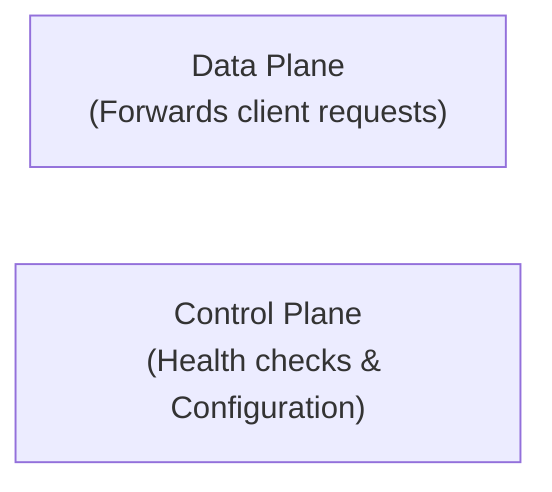
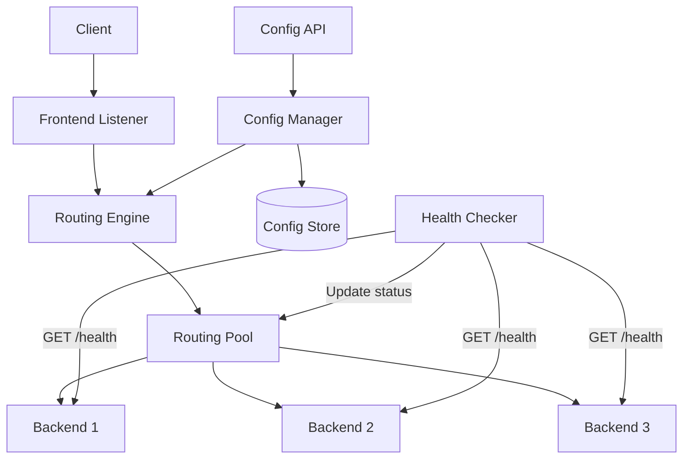
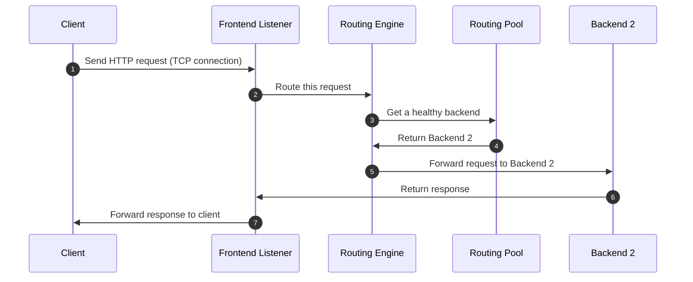
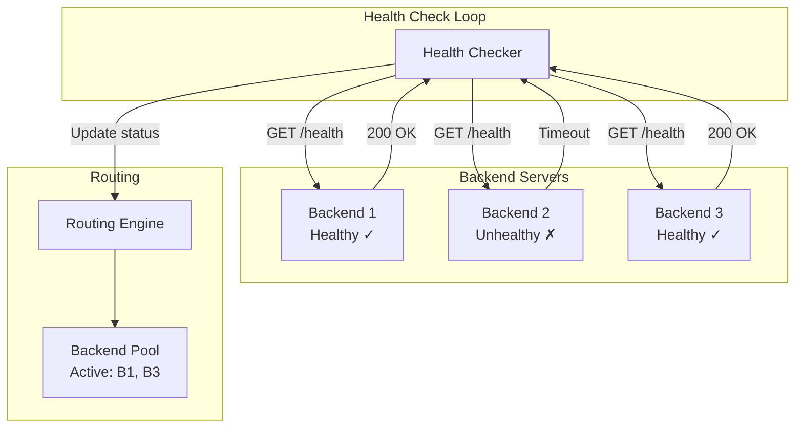
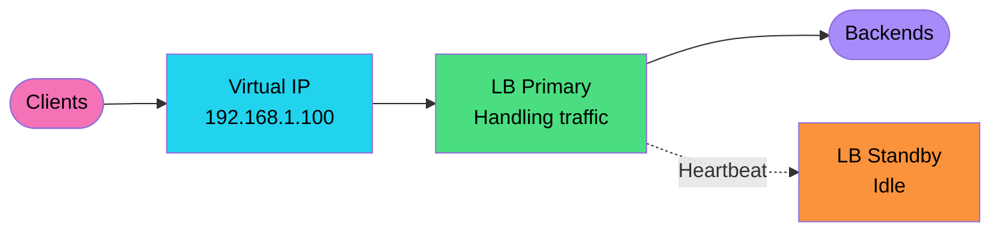
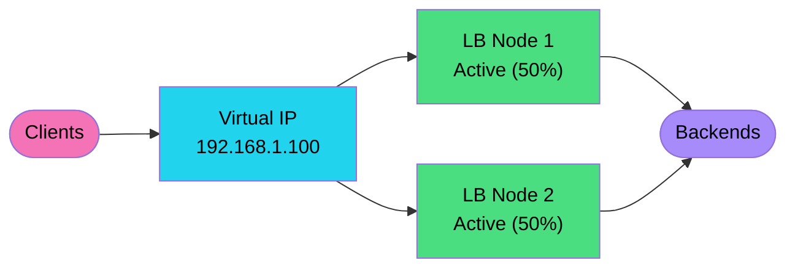
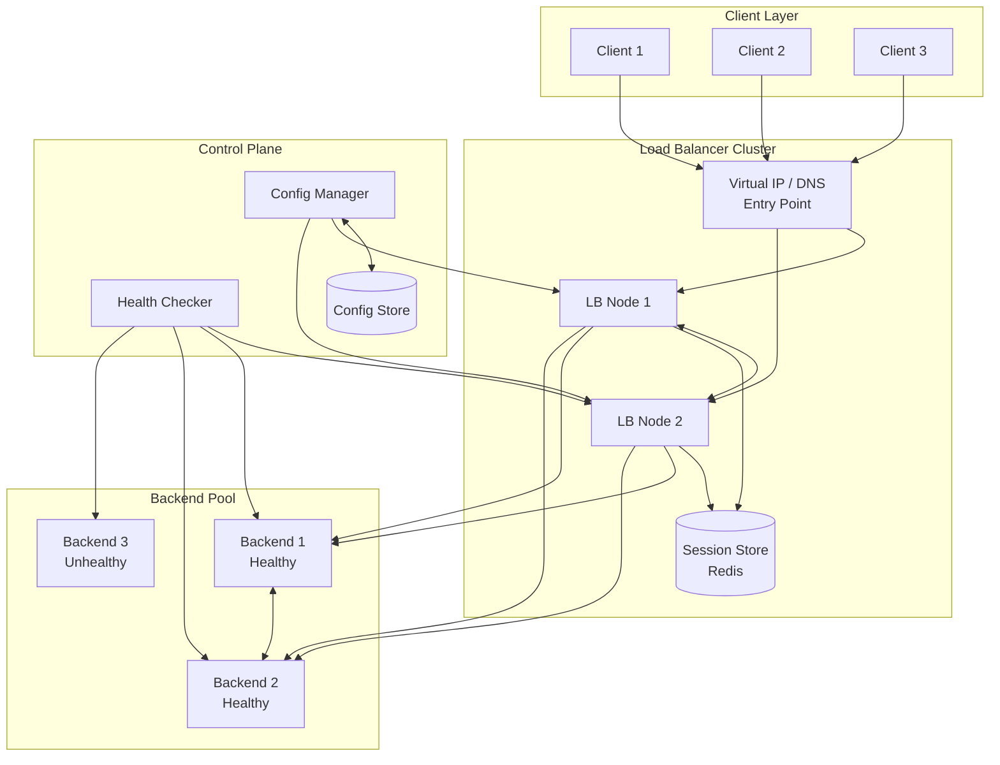

# Load Balancer

## How Internet Communication Works

When a client communicates with a server over the internet — say, `linkedin.com` — the request first travels to a **DNS (Domain Name Server)** to resolve the domain into an IP address. Once the IP is returned, the client connects directly to the target server. DNS servers are typically managed by ISPs (Internet Service Providers), which can be local or global.

**Total request time = DNS resolution time + actual request time**

### DNS Caching

To reduce DNS lookup latency, IP addresses can be cached at multiple levels:

- Browser
- Operating System (OS)
- ISP
- DNS Server

---

## Why Load Balancers Are Needed

For high-traffic platforms like Facebook, Instagram, or LinkedIn, relying on a single IP address creates bottlenecks and risks. To handle this, companies deploy their services across **multiple IP addresses**. The DNS server returns a shuffled list of IPs so that traffic is distributed across servers rather than concentrated on one.

When a request is made:
1. It travels over the public network and reaches a **proxy server** (or load balancer).
2. The load balancer distributes it to one of the available **application servers**.

> **Load balancers evenly distribute incoming traffic across multiple application servers**, ensuring no single server is overwhelmed.

---

## Types of Load Balancers

### 1. Hardware Load Balancer
Dedicated physical devices designed for high-performance traffic distribution.

### 2. Software Load Balancer
Runs as software and is further categorized into:

| Type | Description |
|------|-------------|
| **L4 (Transport Layer)** | Operates on IP address and port number. Faster, but minimal request visibility. |
| **L7 (Application Layer)** | Has access to the full request data (headers, URL, cookies, etc.). More flexible but slightly slower. |

> **L4 load balancers** are generally faster since they only expose minimal information (IP + port), while **L7 load balancers** enable smarter routing decisions using full request context.

---

## Network Architecture

- The load balancer sits on the **public network** and is the entry point for all client requests.
- Application servers reside in a **private network**, hidden from the public.
- The load balancer handles **HTTPS** termination; communication between the load balancer and application servers typically uses **HTTP**.

---

## Service Discovery & Health Monitoring

The load balancer interacts with a **Service Registry**, which maintains:

- IDs and IP addresses of all registered services
- Current status of each service (`active` / `inactive`)

The load balancer continuously monitors service health using mechanisms like **heartbeats**. When a request arrives, the load balancer:

1. Performs **authentication & authorization**
2. Handles **SSL termination**
3. Queries **Service Discovery** for a list of healthy, active services
4. Routes the request based on the configured **load balancing strategy**

---

## Load Balancing Strategies

### 1. Round Robin

Requests are distributed to servers **one after another in a cyclic order**. Each server gets an equal turn, and after the last server is reached, the cycle restarts from the first.

**Advantages:**
- Simplest algorithm to implement
- Maintains fairness across servers
- Low overhead
- Quick response time for lightweight workloads

**Drawbacks:**
- Unaware of current server load
- Leads to inefficient resource utilization under uneven workloads

**Example:**  
Three servers — `S1`, `S2`, `S3`. Requests are routed as: `R1→S1`, `R2→S2`, `R3→S3`, `R4→S1`, and so on.

---

### 2. Least Connection

A more intelligent approach than Round Robin. The load balancer tracks the **number of active connections per server** and always routes the new request to the server with the **fewest active connections**.

**Advantages:**
- Smarter traffic routing
- Works well for long-lived connections (e.g., WebSockets, database connections)
- Performance improves as load patterns stabilize

**Drawbacks:**
- Does not account for task complexity — a server with fewer connections may still be heavily loaded
- Can cause an initial imbalance during startup

**Example:**  
`S1` has 5 active connections, `S2` has 3, and `S3` has 7. The next request goes to `S2`.

---

### 3. Weighted Round Robin / Weighted Least Connection

An advanced extension of Round Robin and Least Connection. Each server is assigned a **weight** based on its capacity or performance. Servers with higher weights receive proportionally more requests.

**Advantages:**
- Better resource utilization across heterogeneous servers
- Adaptable to different server capacities
- Supports priority-based routing
- Scales well in mixed-capacity environments

**Drawbacks:**
- More complex to configure and maintain
- Requires continuous resource monitoring to assign accurate weights

**Example:**  
`S1` has weight `3`, `S2` has weight `2`, `S3` has weight `1`. Out of every 6 requests: `S1` gets 3, `S2` gets 2, `S3` gets 1.

---

### 4. Hashing

Requests are mapped to servers using a **hash function** applied to request attributes (e.g., client IP, session ID, URL). The hash output determines which server handles the request, ensuring consistent routing for the same input.

**Common Hashing Methods:**

| Method | Description |
|--------|-------------|
| Division Remainder | `hash = key % number_of_servers` |
| Multiplicative Hash Function | Uses a multiplier constant for distribution |
| Universal Hashing | Randomized approach to reduce collision probability |
| Cryptographic Hashing | Uses MD5, SHA-256, etc., to resist targeted attacks |

**Advantages:**
- Enables session persistence (sticky sessions)
- Consistent mapping of requests to servers
- Simple to implement with division-based methods

**Drawbacks:**
- Hash **collisions** can route multiple keys to the same server
- Hash functions are **non-invertible**
- Limited security in non-cryptographic variants
- Does not maintain order

**Example:**  
Client IP `192.168.1.10` is hashed and mapped to `S2`. All subsequent requests from that IP consistently go to `S2`.

---

### 5. Random Allocation

Incoming requests are distributed **randomly** across available servers with no predefined pattern or tracking.

**Trade-offs:**
- **Simplicity vs. Efficiency** — Easy to implement but may cause uneven load distribution
- **Uniformity Over Time** — Statistically balanced over a large number of requests
- **No State Tracking Required** — Zero overhead for maintaining connection or load data

**Drawbacks:**
- Unpredictable load distribution in the short term
- No awareness of current server load
- Not suitable for **sticky sessions**

**Example:**  
Five requests arrive — they are randomly assigned: `R1→S3`, `R2→S1`, `R3→S3`, `R4→S2`, `R5→S1`.

---

### 6. Geolocation-Based Load Balancing

Traffic is routed based on the **geographic location** of the client. Requests are directed to the nearest or most appropriate server or data center to minimize latency.

**Trade-offs:**
- **Latency vs. Complexity** — Reduces latency significantly but adds routing complexity
- **Accuracy vs. Overhead** — More accurate geo-detection requires more processing
- **Cost vs. Performance** — Regional deployments improve performance but increase infrastructure cost

**Drawbacks:**
- **Geo-IP inaccuracy** — IP-based location detection can sometimes be incorrect
- **Mobile users** — Frequent location changes make routing less predictable
- **Increased complexity** — Requires maintaining regional infrastructure

**Example:**  
A user in Mumbai is routed to a data center in India (`DC-IN`), while a user in New York is routed to a US-based data center (`DC-US`).

---

### 7. Resource-Based Load Balancing

Routes requests based on the **real-time resource availability** of each server (e.g., CPU usage, memory, disk I/O). This ensures requests go to the server best equipped to handle them at that moment.

**Trade-offs:**
- **Efficiency vs. Complexity** — Highly optimized routing but requires sophisticated monitoring
- **Resource Type vs. Balance** — Balancing across multiple resource types (CPU, RAM, etc.) is non-trivial
- **Cost vs. Performance** — Advanced monitoring tools add infrastructure cost

**Drawbacks:**
- Requires **complex real-time monitoring** of each server
- The monitoring itself introduces **resource overhead**

**Example:**  
`S1` is at 90% CPU, `S2` is at 40% CPU, and `S3` is at 60% CPU. The next request is routed to `S2`.

---

### 8. Rate Limiting

> Rate limiting is not strictly a load balancing strategy, but it plays an important role in **managing traffic load** across application servers.

It limits the number of requests a client or service can make within a defined time window. It is commonly used to:

- Protect server resources from overload
- Prevent abuse (e.g., DDoS attacks, brute force)
- Ensure fair usage among all clients

**Example:**  
An API allows a maximum of `100 requests per minute` per client. Once exceeded, the client receives a `429 Too Many Requests` response until the window resets.

---

## Summary Table

| Strategy | Best For | Key Limitation |
|----------|----------|----------------|
| Round Robin | Uniform, stateless requests | Ignores server load |
| Least Connection | Long-lived connections | Ignores task complexity |
| Weighted Round/Least | Mixed-capacity servers | Requires weight tuning |
| Hashing | Session persistence | Hash collisions |
| Random | Simple, low-overhead systems | Unpredictable short-term balance |
| Geolocation | Global, latency-sensitive apps | Geo-IP inaccuracy |
| Resource-Based | CPU/memory-intensive workloads | Complex monitoring |
| Rate Limiting | Abuse prevention, fair usage | Not a distribution strategy |


# Load Balancer — System Design

---

## 1. Requirements

### 1.1 Functional Requirements

| # | Requirement | Description |
|---|---|---|
| 1 | **Traffic Distribution** | Distribute incoming requests across multiple backend application servers |
| 2 | **Health Checking** | Continuously monitor the health of backend servers; remove failing servers from the routing pool |
| 3 | **Session Persistence** | Maintain sticky sessions so that requests from the same user are routed to the same backend |
| 4 | **SSL Termination** | Handle TLS/SSL encryption and decryption at the load balancer level |
| 5 | **L4 & L7 Load Balancing** | Support load balancing at both the Transport Layer (L4) and Application Layer (L7) |

### 1.2 Non-Functional Requirements

| # | Requirement | Target |
|---|---|---|
| 1 | **High Availability** | 99.99% uptime |
| 2 | **Horizontal Scalability** | Scale out by adding more nodes |
| 3 | **Low Latency** | Minimal added latency per request |
| 4 | **High Throughput** | Handle up to **1 million requests per second** at peak |
| 5 | **Fault Tolerance** | Continue operating even when individual components fail |

---

## 2. Capacity Estimation

### 2.1 Traffic Estimates

| Metric | Value |
|---|---|
| Peak traffic | 1,000,000 requests/second |
| Average traffic | ~300,000 requests/second *(~⅓ of peak)* |
| Avg request processing time | 500ms |
| Concurrent connections | `1,000,000 × 0.5s = 500,000 connections` |

### 2.2 Bandwidth Estimates

| Metric | Calculation | Result |
|---|---|---|
| Avg request size | — | 2 KB |
| Avg response size | — | 10 KB |
| Incoming bandwidth | 1M RPS × 2 KB | **2 GB/s** |
| Outgoing bandwidth | 1M RPS × 10 KB | **10 GB/s** |
| **Total bandwidth** | — | **~12 GB/s** |

### 2.3 Health Check Overhead

Assuming **1,000 backend servers**, each polled every **5 seconds**:

```
Health check rate = 1000 / 5 = 200 checks/second
```

### 2.4 Key Insights

1. **Network bandwidth** is the primary bottleneck — approximately **12 GB/s** of data is in transit at peak.
2. Health check monitoring generates **~200 checks/second**, which is negligible overhead.
3. **Horizontal scaling** of the load balancer is necessary to sustain this level of throughput.

---

## 3. Core APIs

The load balancer is made up of two planes:

- **Data Plane** — The entry point for all client traffic. It is extremely fast and simply forwards requests to the appropriate backend.
- **Control Plane** — Responsible for backend registration, health checking, and load balancing configuration.



---

### 3.1 Register Backend

**`POST /backend`**

Registers a new backend server and adds it to the routing pool. The server status is initially set to `unknown` until the health checker runs for the first time.

**Request Body:**

```json
{
  "address": "192.168.1.25",
  "port": 8080,
  "weight": 5,
  "health_check_url": "/health"
}
```

**Response:**

```json
{
  "backend_id": "backend-007",
  "address": "192.168.1.25",
  "port": 8080,
  "weight": 5,
  "status": "unknown",
  "message": "Backend registered successfully. Health check pending."
}
```

---

### 3.2 Remove Backend

**`DELETE /backend/{backendId}`**

Removes a backend server from the routing pool. The load balancer immediately stops routing new requests to it. Any connections that were active at the time of removal are reported via `drained_connections`.

**Path Parameter:** `backendId` — the unique identifier of the backend to remove.

**Response:**

```json
{
  "message": "Backend successfully removed from routing pool.",
  "backend_id": "backend-007",
  "drained_connections": 12
}
```

> `drained_connections` indicates the number of active connections that were in progress at the time the backend was removed.

---

### 3.3 Check Backend Health

**`GET /backend/{backendId}/health`**

Returns the current health status of a specific backend server. Most systems expose this endpoint at `/health` or `/healthz`.

**Path Parameter:** `backendId` — the unique identifier of the backend.

**Response:**

```json
{
  "backend_id": "backend-007",
  "address": "192.168.1.25",
  "port": 8080,
  "status": "active",
  "last_checked": "2024-11-15T10:32:00Z",
  "response_time_ms": 42
}
```

> Possible values for `status`: `active`, `inactive`, `unknown`

---

### 3.4 Configure Load Balancing Algorithm

**`PUT /config/algorithm`**

Updates the active load balancing strategy and session configuration. This determines how incoming traffic is distributed across backend servers.

**Request Body:**

| Field | Type | Description |
|---|---|---|
| `algorithm` | `string` | One of: `round_robin`, `least_connection`, `ip_hash`, `weighted_round_robin` |
| `sticky_session` | `boolean` | Enable or disable sticky sessions |
| `sticky_ttl_seconds` | `integer` | Duration (in seconds) for which a sticky session remains valid |

**Example:**

```json
{
  "algorithm": "least_connection",
  "sticky_session": true,
  "sticky_ttl_seconds": 300
}
```

**Response:**

```json
{
  "message": "Load balancing algorithm updated successfully.",
  "algorithm": "least_connection",
  "sticky_session": true,
  "sticky_ttl_seconds": 300
}
```

---

## 4. High-Level Design

The load balancer must fulfill three fundamental responsibilities:

- Accept and forward **client traffic**
- **Monitor backend health** continuously
- **Stay highly available** at all times

Client-facing traffic is handled by the **Data Plane**, while backend management and configuration are handled by the **Control Plane**. The data plane is optimized for speed; the control plane prioritizes correctness and configuration consistency.



---

### 4.1 Traffic Distribution

The most fundamental job of the load balancer is distributing traffic evenly across available backend servers. Three key components collaborate to achieve this:

#### a) Frontend Listener

The frontend listener is the **gateway** for all incoming client requests. It binds to one or more ports — typically **port 80** for HTTP and **port 443** for HTTPS — and accepts incoming TCP connections.

- For **L7 load balancing**: parses the full HTTP request (headers, URL, body)
- For **L4 load balancing**: works only with the IP address and port number
- Hands off the connection to the **Routing Engine** for further processing

#### b) Routing Engine

The routing engine is the **brain** of the load balancer. It maintains:

- A list of available backend servers with metadata (IP address, port, status)
- The current state of each server (healthy / unhealthy)
- Connection counters for tracking active load
- The configured load balancing algorithm

It applies the active algorithm to select the most appropriate backend for each incoming request.

#### c) Routing Pool

The routing pool maintains the **live list of available backend servers**. In more advanced architectures, it can maintain separate pools for different services or traffic types.

---

#### Request Flow — Sequence Diagram



**Flow Explanation:**

1. The **client** initiates an HTTP/TCP connection to the frontend listener.
2. The **frontend listener** accepts the connection and hands it to the routing engine.
3. The **routing engine** queries the routing pool for a healthy backend.
4. The **routing pool** returns the selected backend (e.g., Backend 2) based on the algorithm.
5. The **routing engine** forwards the request to Backend 2.
6. **Backend 2** processes the request and returns a response to the frontend listener.
7. The **frontend listener** forwards the response back to the client.

---

### 4.2 Health Monitoring

Without health monitoring, the load balancer may route requests to servers that are down or unresponsive — causing errors and degraded user experience. The health monitoring component continuously tracks backend availability and ensures requests are only routed to healthy servers.

The health checker is responsible for:

- Sending **periodic probes** to each backend server
- **Tracking the response history** of each backend
- **Marking a backend as unhealthy** when it fails to respond within the threshold
- **Re-admitting a backend** to the routing pool once it recovers



#### Types of Health Checks

| Type | Mechanism | What It Verifies |
|---|---|---|
| **TCP Check** | Opens a TCP connection to the backend | Server is reachable, but not necessarily functioning correctly |
| **HTTP Check** | Sends an HTTP GET request to `/health` | Application is running and responding as expected |

---

### 4.3 High Availability

A load balancer introduced to eliminate single points of failure must not itself become one. If the load balancer goes down, the entire system becomes unreachable. To prevent this, multiple load balancer instances must be deployed so that failover is automatic and seamless.

There are two patterns to achieve this:

---

#### Pattern 1: Active-Passive

One load balancer is **active** (handling all traffic) while one or more others remain on **standby**. The standby continuously monitors the primary via a **heartbeat**. If the primary fails, the standby immediately takes over using a shared **Virtual IP (VIP)** — a single IP address that clients connect to, but which can be reassigned between nodes.



**Advantages:** Simple to implement and operate.

**Drawbacks:** The standby node consumes resources (CPU, memory) while idle, even though it is not serving traffic.

---

#### Pattern 2: Active-Active

All load balancer nodes are **active simultaneously** and share the incoming traffic load. If one node fails, the remaining nodes absorb its traffic automatically. For example, with two nodes each handling 50% of traffic, a failure causes the surviving node to temporarily handle 100%.



**Advantages:** Full resource utilization; instant failover; horizontally scalable.

**Drawbacks:** More complex to configure; sticky sessions require a **shared session store** (e.g., Redis) to maintain consistency across nodes.

---

#### Comparison: Active-Passive vs Active-Active

| Consideration | Active-Passive | Active-Active |
|---|---|---|
| **Complexity** | Simpler | More complex |
| **Resource Utilization** | ~50% (standby is idle) | ~100% |
| **Failover Time** | 1–3 seconds | Instant |
| **Sticky Sessions** | Easy (single node) | Requires shared state store |
| **Scalability** | Limited to one node's capacity | Scales horizontally |

---

### 4.4 Full System Architecture

Putting everything together — the client layer, load balancer cluster, control plane, and backend pool:



**Component Roles:**

- **Virtual IP / DNS Entry Point** — Single address that all clients connect to; reassignable between LB nodes for failover
- **LB Node 1 & 2** — Active load balancer nodes that distribute traffic across backends
- **Session Store (Redis)** — Shared store for sticky session data, accessible by all LB nodes
- **Config Manager** — Manages and pushes load balancing configuration to LB nodes
- **Config Store** — Persistent storage for load balancer configuration
- **Health Checker** — Continuously probes backends and updates their status in the routing pool
- **Backend Pool** — The set of application servers receiving and processing client requests
