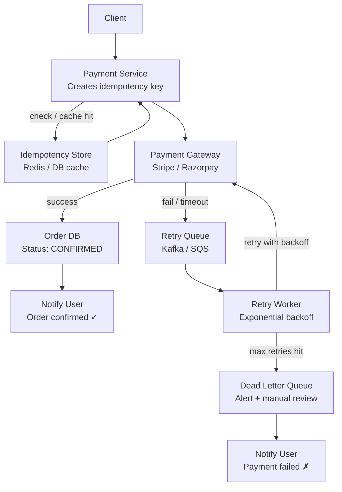

Here’s your content **cleanly formatted for a GitHub `.md` file** with proper structure, headings, readability, and professional tone 👇

---

```markdown
# 💳 Payment Retry System Design for E-commerce Platform

Handling payment retries is a **critical reliability concern** in any e-commerce platform. A robust retry mechanism ensures **no double charges**, **high success rate**, and **fault tolerance**.

---

## 🚨 Common Reasons for Payment Failure

- Network timeout  
- Payment gateway downtime  
- Bank-side temporary failures  
- Idempotency issues leading to duplicate charges  

---

## 🔑 Idempotency Strategy (Must Have)

To prevent **duplicate payments**, every payment request must be **idempotent**.

### 🔄 Flow

```

Client → Generate Idempotency Key → Payment Service

Payment Service → Store (key, status, response) in DB

On Retry:
Use same key →
If SUCCESS → return stored response
Else → retry via payment gateway

```

---

## 🗄️ Idempotency Table Schema

| Field            | Description                  |
|------------------|------------------------------|
| Idempotency Key  | Unique key per payment       |
| Status           | SUCCESS / FAILED / PENDING   |
| JSON Response    | Gateway response             |
| Created At       | Timestamp                    |
| Expires At       | TTL for cleanup              |

---

## 🔁 Retry Architecture (3-Layer Design)

### 1️⃣ Synchronous Retry
- Used for **transient issues** (e.g., network failure)
- Only **1 retry attempt**
- Keeps latency under control

---

### 2️⃣ Asynchronous Retry

When sync retry fails, push to queue:

```

Payment Failed
↓
Retry Queue (Kafka / SQS)
↓
Retry Worker
↓
┌───────────────┬───────────────────────────┐
│ Success       │ Failure                   │
│               │                           │
↓               ↓
Update DB        Increment attempt count
Notify User      Apply backoff strategy

```

---

### 3️⃣ Scheduled Retry / Dead Letter Queue (DLQ)

- After **N retries**, move to **DLQ**
- Used for:
  - Manual inspection  
  - Alerting  
  - Debugging failures  

---

## ⏳ Exponential Backoff Strategy

To avoid overwhelming systems:

```

retry_delay = min(base_delay + 2^attempt, max_delay)

```

### Example:

| Attempt | Delay  |
|--------|--------|
| 1      | 2 sec  |
| 2      | 4 sec  |
| 3      | 8 sec  |
| 4      | 16 sec |

✔ Always cap with a **maximum delay**

---

## 🔄 Payment State Machine

```

Initialized
↓
Pending
↓
┌───────────────┬─────────────────────────────┐
│ Success       │ Failure / Timeout           │
↓               ↓
Confirm Order    Retry Queued
Update DB              ↓
Retry Attempts
↓
┌───────────────┐
│ Max Attempts  │
↓               ↓
Success         Failed → Notify User

```

---

## ✅ Key Takeaways

- Use **Idempotency** to avoid duplicate charges  
- Combine **sync + async retries** for reliability  
- Use **queues + workers** for scalability  
- Apply **exponential backoff** to reduce system load  
- Use **DLQ** for observability and manual recovery  

---

This design ensures **high reliability, fault tolerance, and user trust** in payment systems.
```

